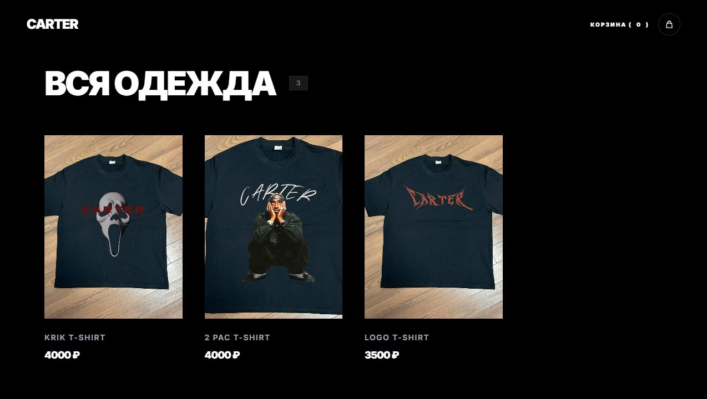
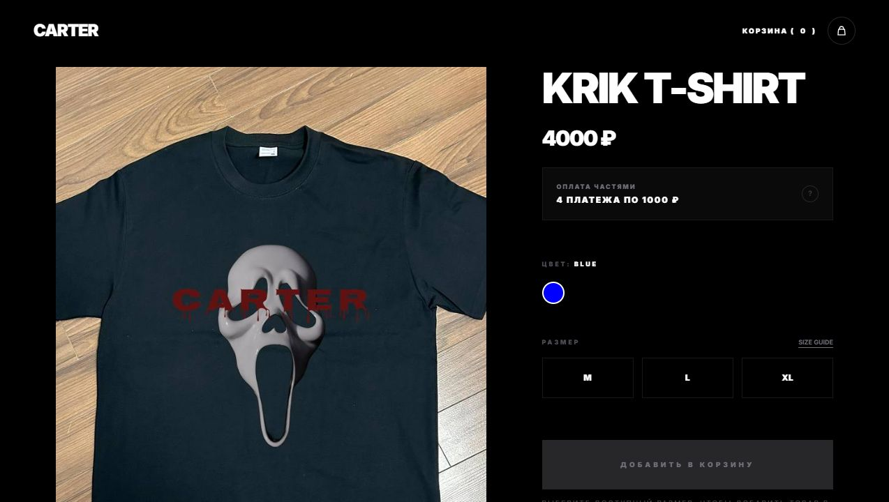
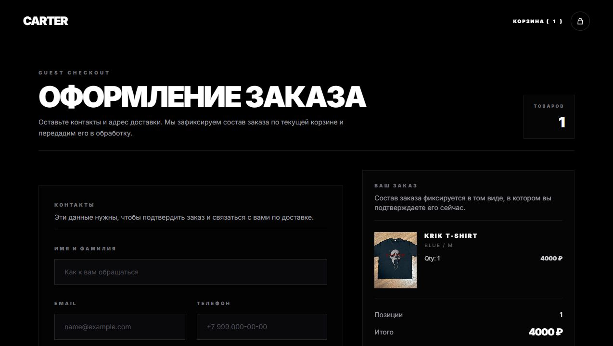
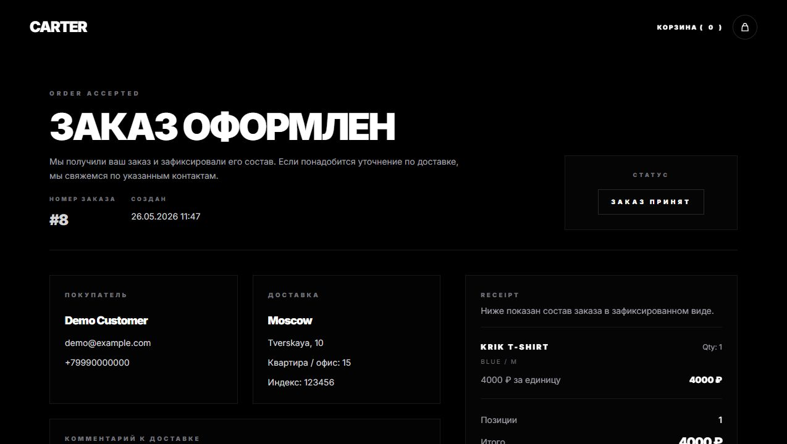
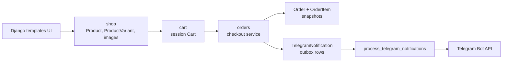

# Carter

**CARTER CLOTHING** - Django storefront для каталога одежды, session-based cart и guest checkout без лишней инфраструктуры. README собран как портфолио-витрина: быстро показывает UI, доменную модель, транзакционный checkout и тестируемые инженерные решения.



## Stack


## Demo Flow

1. Каталог товаров с изображениями, ценами и ручной сортировкой.
2. Product detail: галерея, выбор цвета и размера, проверка доступных `ProductVariant`.
3. Session cart drawer и отдельная cart page с AJAX stepper для изменения количества.
4. Guest checkout с контактами, адресом доставки и summary заказа.
5. Success receipt с зафиксированными snapshot-данными заказа.
6. Telegram manager notification через database outbox и management command.

| Product detail | Checkout | Order receipt |
| --- | --- | --- |
|  |  |  |

## Engineering Highlights

- `ProductVariant` - центральная складская сущность: связывает товар, цвет, размер, stock и доступность варианта.
- `Cart` хранится в Django session, самовосстанавливает устаревшие строки, удаляет недоступные варианты и ограничивает quantity текущим stock.
- Checkout вынесен в service layer и выполняется через `transaction.atomic`, `select_for_update` и `transaction.on_commit(cart.clear)`.
- `OrderItem` хранит snapshot полей товара, цены, цвета и размера, поэтому receipt не ломается после изменений каталога.
- Telegram notifications реализованы как outbox: checkout создает `TelegramNotification`, а `process_telegram_notifications` отправляет due-сообщения и планирует retry после ошибок.
- Для окружений разделены `config.settings.dev` и `config.settings.test`; тестовые настройки не зависят от локального `.env`.
- Django admin настроен для управления каталогом, заказами, order items и диагностикой Telegram notification retries.

## Architecture



## Testing Focus

В тестах проекта зафиксированы не только happy path, но и бизнес-инварианты:

- cart core: add/increment/decrement/remove/clear, runtime cache invalidation, удаление битых session rows;
- cart views: POST-only операции, AJAX JSON payload, redirect back to product, cart drawer state;
- checkout transaction: создание заказа, списание stock, очистка cart после commit;
- order snapshots: цены и названия остаются историческими после изменений каталога;
- Telegram outbox: создание notification rows, формат сообщения, retry после ошибки, sent notifications не переотправляются;
- success page: одноразовый `last_order_id` в session и receipt из snapshot-данных.

```powershell
.\.venv\Scripts\python.exe manage.py check --settings=config.settings.test
.\.venv\Scripts\python.exe manage.py test cart.tests --settings=config.settings.test
.\.venv\Scripts\python.exe manage.py test orders.tests --settings=config.settings.test
```

## Quick Start

```powershell
python -m venv .venv
.\.venv\Scripts\python.exe -m pip install -r requirements.txt
Copy-Item .env.example .env
.\.venv\Scripts\python.exe manage.py migrate
.\.venv\Scripts\python.exe manage.py runserver
```

Unix:

```bash
python3 -m venv .venv
./.venv/bin/python -m pip install -r requirements.txt
cp .env.example .env
./.venv/bin/python manage.py migrate
./.venv/bin/python manage.py runserver
```

Required `.env` keys:

- `SECRET_KEY`
- `DEBUG`
- `ALLOWED_HOSTS`
- `TELEGRAM_NOTIFICATIONS_ENABLED`
- `TELEGRAM_BOT_TOKEN`
- `TELEGRAM_MANAGER_CHAT_IDS`
- `TELEGRAM_NOTIFICATION_RETRY_MINUTES`

## Telegram Notifications

Checkout не отправляет Telegram-сообщение напрямую. Он создает pending rows в базе, а отдельная команда забирает due notifications:

```powershell
.\.venv\Scripts\python.exe manage.py process_telegram_notifications
```

Cron example:

```cron
* * * * * cd /srv/carter && ./.venv/bin/python manage.py process_telegram_notifications
```

## Project Structure

```text
shop/    catalog domain: products, variants, colors, sizes, images, product pages
cart/    session cart, cart views, AJAX quantity stepper, cart context processor
orders/  guest checkout, order snapshots, Telegram outbox, notification command
config/  settings package, URLs, ASGI/WSGI entrypoints
```
